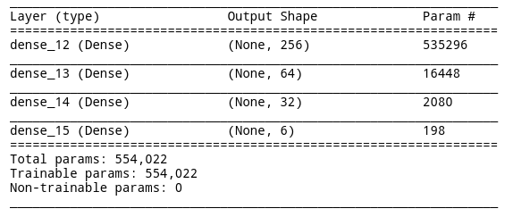

# Raman Classifier

Classifies Raman spectra using TensorFlow and Keras.
This is an old project that is being given a new lease of life so please point any old mistakes / bad practices [as an issue](https://github.com/rjkilpatrick/raman-cnn/issues).

At the moment, it doesn't even save the model trained, but will _hoefully_ be improved in

## Installation

1. `git clone https://github.com/rjkilpatrick/raman-cnn/`
1. `jupyter notebook raman-cnn`

## Technologies

- Python, created in 3.7.4, but most
- Git, using [Gitmoji](https://gitmoji.carloscuesta.me/) style commits
- TensorFlow 2

## Project staus

The current implementation, uses a four layer **densely** connected neural network.
The layer sizes were chosen as random powers of two and was ill-informed.
In future, this will be moved to a convolutional style neural network.

The accuracy of the model is 90.7%.
This is on a small dataset with no data augmentation with a shared training/validation set.

## License

The dataset is taken from <https://www.kaggle.com/andriitrelin/cells-raman-spectra/activity>, licensed under CC-BY-NC 4.0.

All code is (c) John Kilpatrick under the MIT license.
